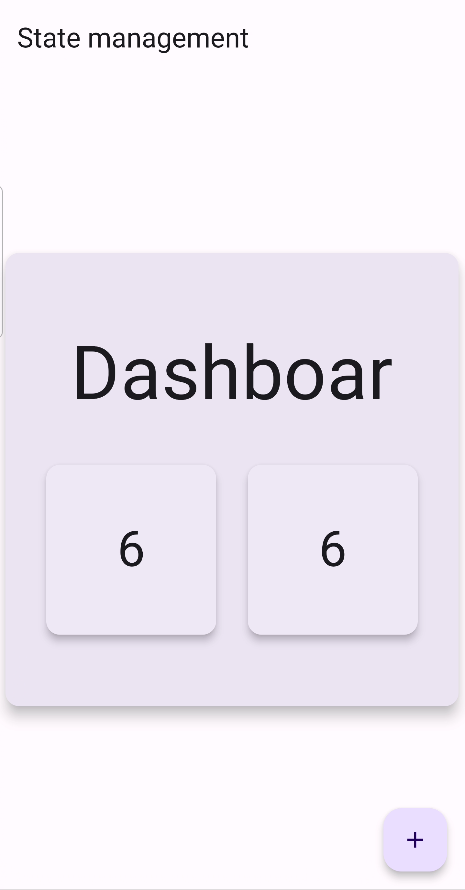

# state_management_getx

# تطبيق إدارة الحالة باستخدام GetX

هذا المشروع هو مثال توضيحي لاستخدام GetX لإدارة الحالة في تطبيق Flutter. يهدف المشروع إلى توفير مثال عملي على كيفية استخدام GetX لإدارة الحالة والتنقل بين الصفحات.

## صور توضيحية

### الشاشة الرئيسية


## كيفية استخدام المشروع

### المتطلبات
- Flutter SDK مثبت على جهازك.
- محرر نصوص مثل Visual Studio Code أو Android Studio.

### خطوات التشغيل
1. **نسخ المستودع:**
   ```sh
   git clone https://github.com/YourUsername/YourRepository.git
